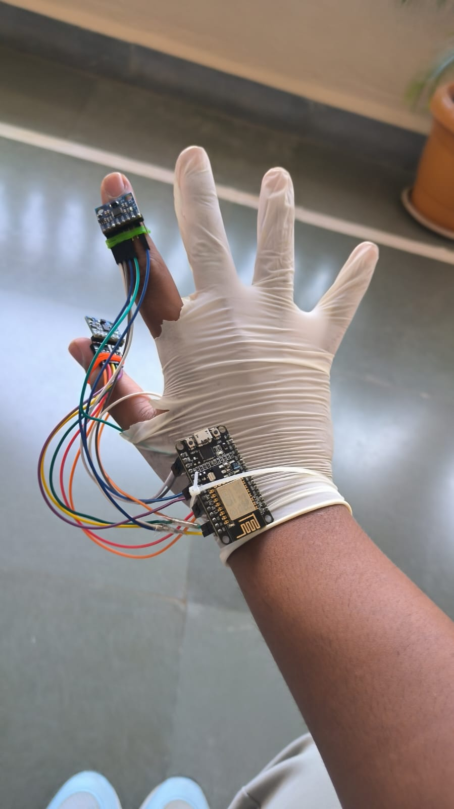

# Hand Gesture Based Automation
**Hand Gesture based controlling your pc's automation**

> MY PROJECT BASED LEARNING PROTOTYPE

| Component | Description |
| ----------- | ----------- |
| MPU6050 | Accelerometer |
| ESP8266 | Microcontroller |
| Arduino IDE | Compiler |
